# 基于Springboot的网页时装购物系统

## Springboot-0004


## 技术栈

Springboot mybatisplus vue mysql maven


## 数据库表(15张)


## 功能介绍

```properties
管理员
首页、个人中心、用户管理、商品分类管理、颜色管理、商品信息管理、商品评价管理、系统管理、订单管理，用户；首页、个人中心、商品评价管理、我的收藏管理、订单管理，前台首页；首页、商品信息、商品资讯、个人中心、后台管理、购物车、客服等功能
```


## 图片

### 前台


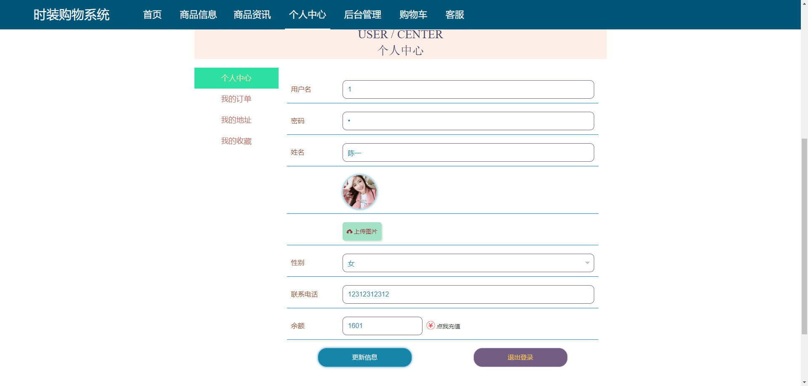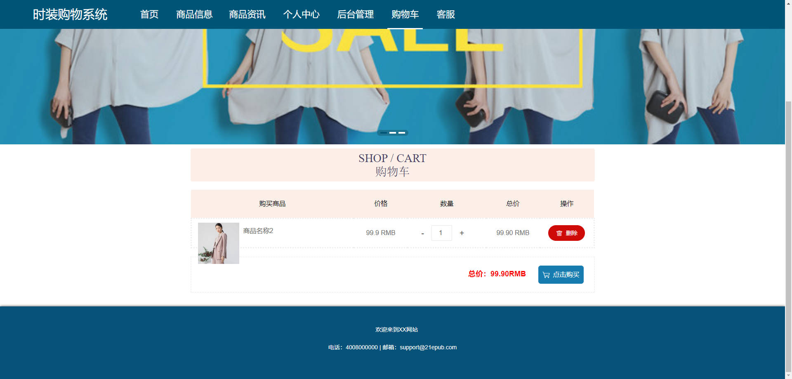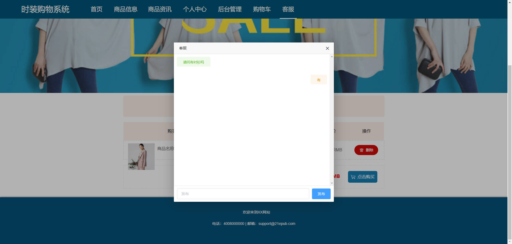

### 后台


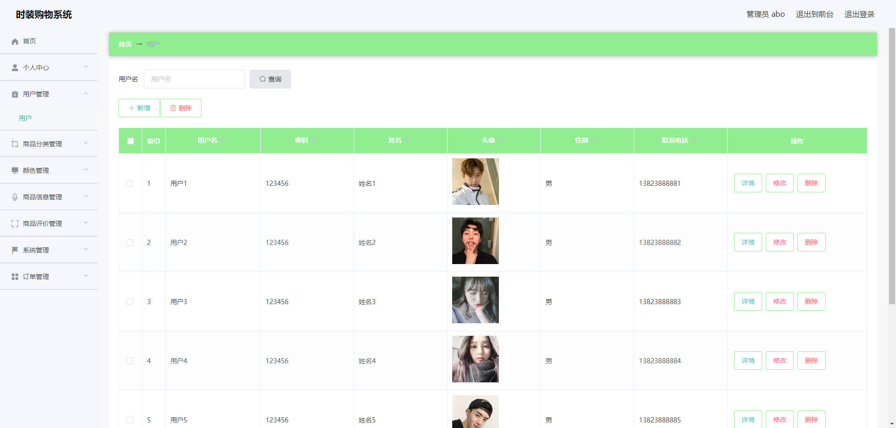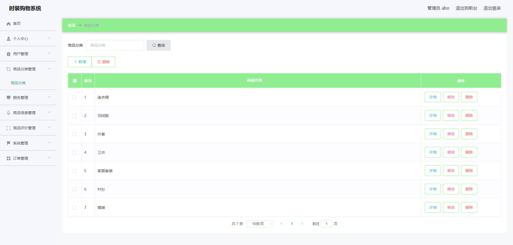

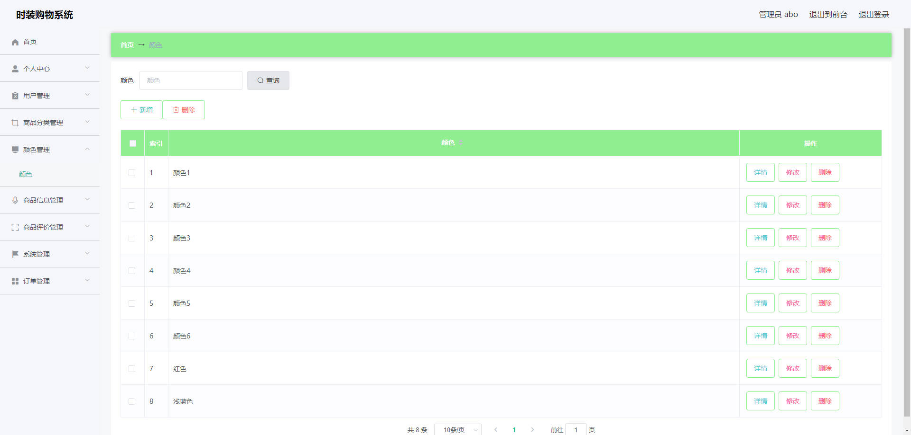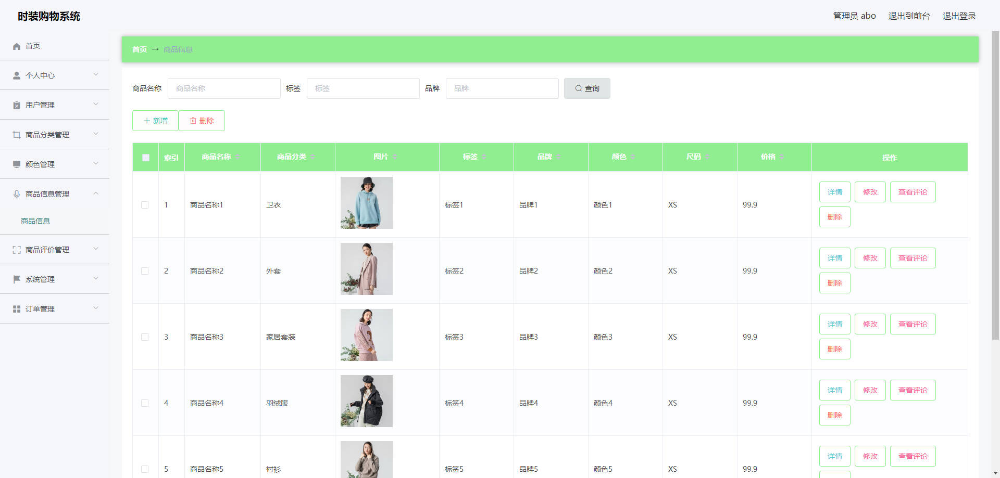


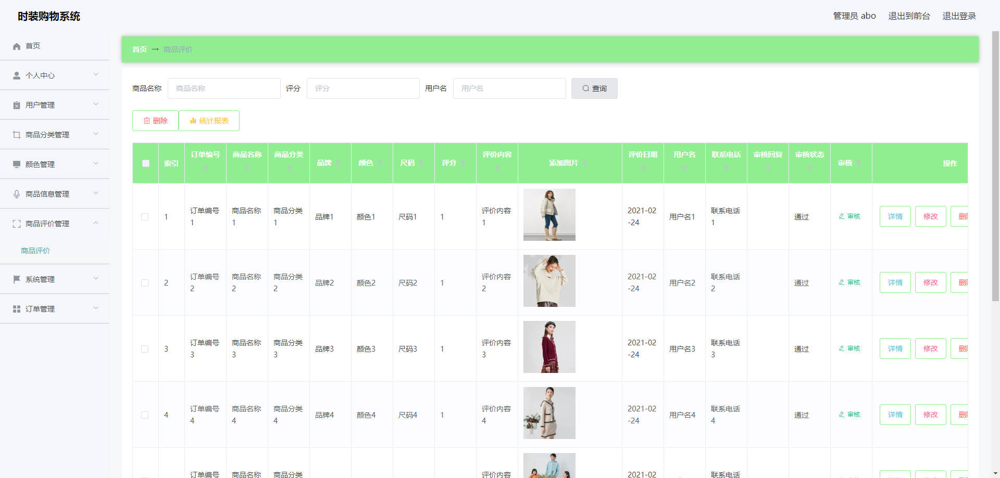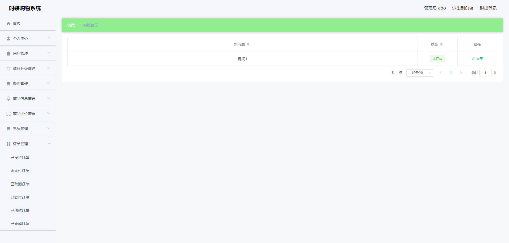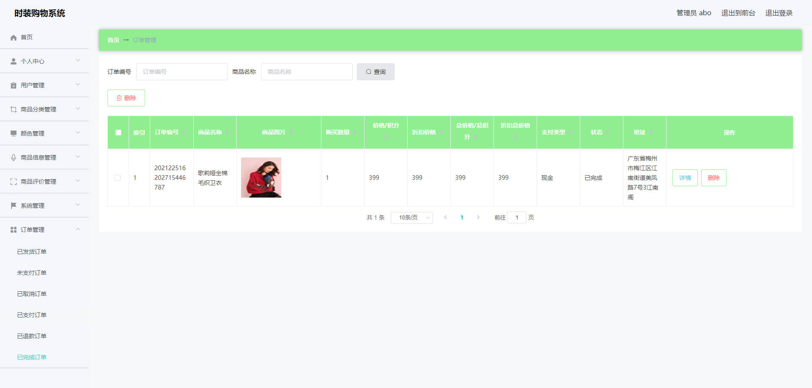


## 访问路径

### 前台

```properties
http://localhost:8080/springbootw3o95/front/pages/login/login.html

账号 1
密码 1
```

### 后台

```properties
http://localhost:8080/springbootw3o95/admin/dist/index.html#/login

账号 abo
密码 aboo
```


## 功能图

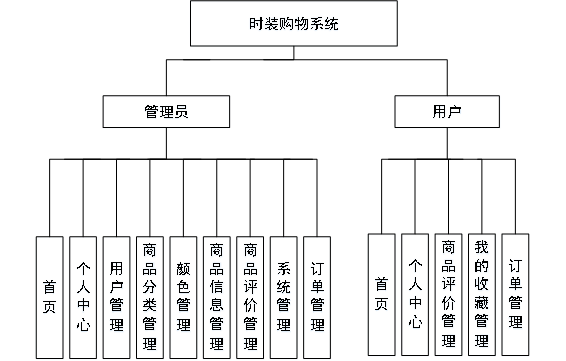


## 文档目录

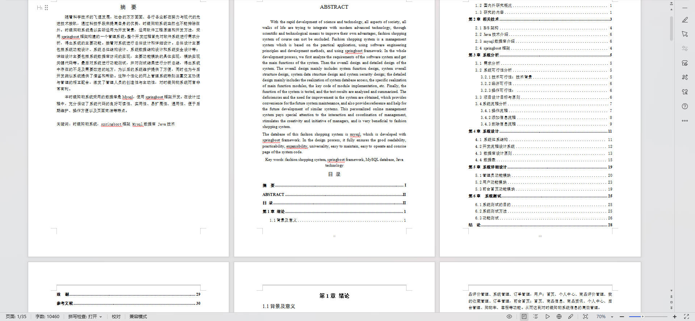


## 打赏或交流


